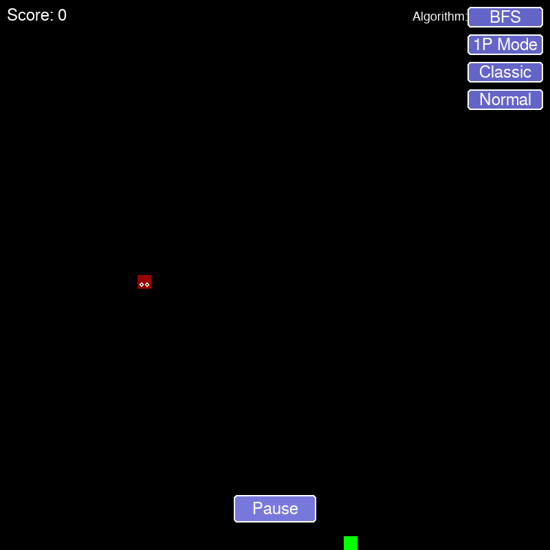

# 🐍 Snake Game with AI Pathfinding

A modern implementation of the classic Snake game with AI pathfinding algorithms, multiple game modes, and two-player capabilities.



## 🎮 Features

- **Multiple AI Pathfinding Algorithms**:
  - Breadth-First Search (BFS)
  - Depth-First Search (DFS)
  - Bidirectional Search

- **Game Modes**:
  - **Classic**: Traditional snake gameplay with clean board
  - **Challenge**: Race against a 60-second timer to get the highest score
  - **Survival**: Snake speed increases as your score grows

- **Difficulty Levels**:
  - **Easy**: Slower snake, fewer obstacles, lower bonus food chance
  - **Normal**: Balanced gameplay
  - **Hard**: Faster snake, more obstacles, higher bonus food chance

- **Two-Player Mode**:
  - Play against an AI opponent
  - Manual controls vs. AI pathfinding

- **Special Gameplay Elements**:
  - Bonus food for extra points
  - Double score powerups
  - Obstacles that vary by difficulty and game mode
  - GIF replay saving functionality

## 🚀 Getting Started

### Prerequisites

- Python 3.6 or higher
- Pygame
- NumPy
- Pillow (PIL)

### Installation

1. Clone the repository:
   ```bash
   git clone https://github.com/Scodeme17/Traditional-Snake.git
   cd Traditionaal-Snake
   ```

2. Install the required packages:
   ```bash
   pip install pygame numpy pillow
   ```

3. Run the game:
   ```bash
   python main.py
   ```

## 🕹️ How to Play

- **Arrow Keys**: Control the snake manually
- **Buttons**:
  - Start/Pause: Control game flow
  - Algorithm: Switch between AI pathfinding methods
  - 1P/2P Mode: Toggle between single player and two-player mode
  - Game Mode: Cycle through Classic, Challenge, and Survival modes
  - Difficulty: Cycle through Easy, Normal, and Hard difficulties
  - Save GIF Replay: Create an animated GIF of your gameplay

In one-player mode, the AI will control the snake unless you use the arrow keys to take manual control.

## 🧠 AI Algorithms

The game implements three different pathfinding algorithms:

1. **BFS (Breadth-First Search)**:
   - Finds the shortest path to the food
   - Guarantees optimal solution
   - More memory intensive

2. **DFS (Depth-First Search)**:
   - Explores paths deeply before backtracking
   - May not find the shortest path
   - Less memory usage than BFS

3. **Bidirectional Search**:
   - Searches simultaneously from both snake head and food
   - Often faster than unidirectional search
   - Combines advantages of forward and backward search

## 🗂️ Project Structure

- `main.py`: Main game logic and SnakeGame class
- `gui.py`: Rendering and UI components
- `bfs.py`: Breadth-First Search implementation
- `dfs.py`: Depth-First Search implementation
- `bidirectional.py`: Bidirectional Search implementation

## 🛠️ Customization

You can easily customize game parameters by modifying constants in the code:

- Adjust grid size and dimensions in `gui.py`
- Modify snake speed and bonus food chances in `main.py`
- Change obstacle generation behavior in the `create_obstacles` method

## 📷 GIF Replay

The game automatically captures screenshots during gameplay. When your game ends or is paused, you can click the "Save GIF Replay" button to create an animated GIF of your session. GIFs are saved in the same directory as the game with timestamped filenames.

## 🤝 Contributing

Contributions are welcome! Feel free to submit a Pull Request.

## 📄 License

This project is licensed under the MIT License - see the LICENSE file for details.

## 🙏 Acknowledgements

- Inspired by the classic Snake game
- Built with Pygame
- Implements various AI pathfinding algorithms
